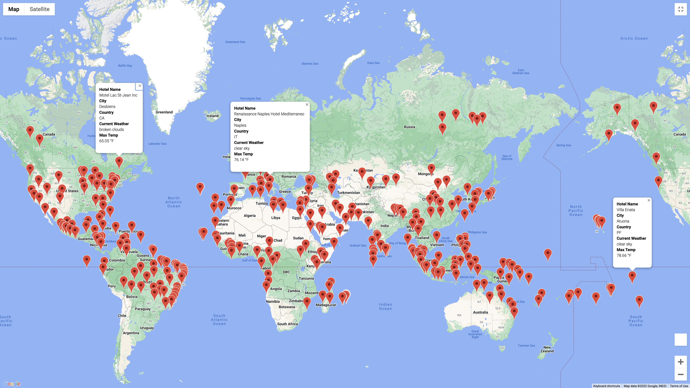

# World_Weather_Analysis

## WeatherPy

### Deliverable 1 
#### Weather_Database
A csv file was created by generating 2,000 random coordinates and performing an API call to retrieve data. 

### Deliverable 2

#### Customer Travel Destinations Map

Gather hotel information with data gathered in deliverable 1. 

### Deliverable 3 
#### Travel Itinerary 
Create a travle itinerary with data from Deliverable 2. 

